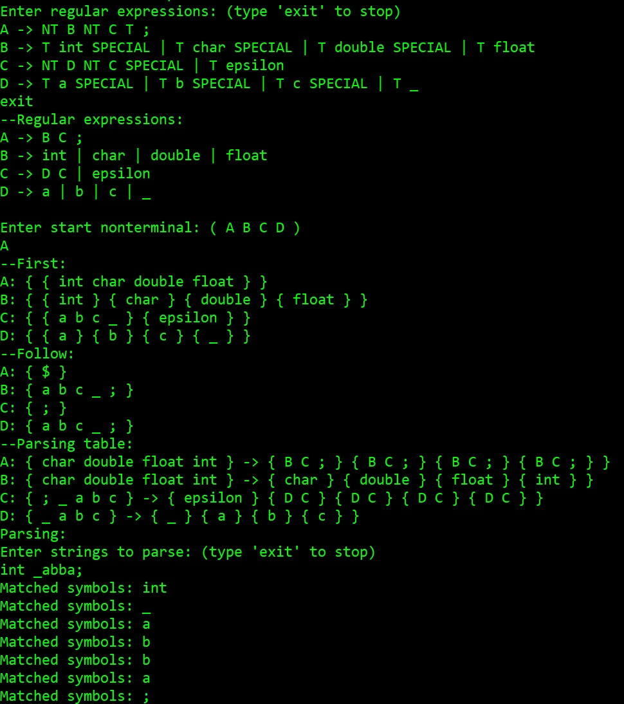

# LL1-parser

**Format:**  
NT -> 'type' 'name' ...  
**Ex:**  
"S -> NT F SPECIAL | T epsilon" --- "S -> F | epsilon"  
# How to use:  
**-Enter regular expression("exit" to stop)**  
**-Enter start nonterminal**  
**-See all of this stuff that's popped out**  
**-Enter string to parse("exit" to stop)**  

  
# More examples:  
**A -> NT B NT C T ;**  
**B -> T int SPECIAL | T char SPECIAL | T double SPECIAL | T float**  
**C -> NT D NT C SPECIAL | T epsilon**  
**D -> T a SPECIAL | T b SPECIAL | T c SPECIAL | T __**  

